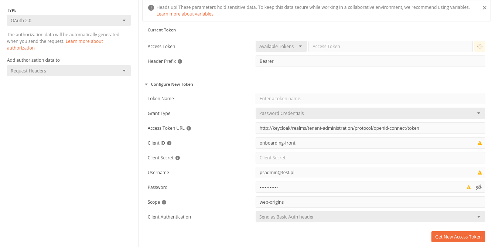

For local development on minikube check ingress address and add entry to /etc/hosts 
```
ingress-address(eg.192.168.49.2) keycloak
```

Keycloak is available under address
```
keycloak/
```

* Login details for the admin console:
```
KEYCLOAK_USER: admin
KEYCLOAK_PASSWORD: admin
```

4 roles have been created:
```
companyAdministrator
implementationConsultant
psAdmin
user

```
Client Id for Onboarding frontend application:
```
onboarding-front
```

Configuration for realm `tenant-administration` with useful links:
```
http://keycloak/realms/tenant-administration/.well-known/openid-configuration
```

Login details for the PeopleStrategy Administrator:
```
Login: psadmin
Email: psadmin@test.pl
Hasło: psAdmin123!
```

Login details for the Implementation Consultant:
```
Login: implconsultant
Email: consultant@test.pl
Hasło: consultant123!
```

Login details for the administrator of the company 'Test':
```
Login: testcompanyadmin
Email: testcompanyadmin@test.pl
Hasło: test123!
```
Login details for the user of the 'Test' company:
```
Login: testcompanyuser
Email: testcompanyuser@test.pl
Hasło: test123!
```
Generating a token using Postman:

